```
   _____ ___________   ______  ____  ________  ____________
  / ___//  _/ ____/ | / / __ )/ __ \/  _/ __ \/ ____/ ____/
  \__ \ / // / __/  |/ / __  / /_/ // // / / / / __/ __/   
 ___/ // // /_/ / /|  / /_/ / _, _// // /_/ / /_/ / /___   
/____/___/\____/_/ |_/_____/_/ |_/___/_____/\____/_____/   
```

<p align="center">
  <b>ASL Fingerspelling → Text → AI Cleanup → Speech</b><br/>
  <sub>An assistive computer-vision + generative-AI web app that gives non-verbal ASL fingerspellers a real-time voice.</sub>
</p>

<p align="center">
  
  
  
  
  
</p>

```bash
user@miraí-capstone:~$ ./launch_signbridge.sh
> Booting camera pipeline .............. OK
> Loading MediaPipe Hand Landmarker ..... OK
> Loading Random Forest (200 trees) ..... OK
> Connecting to Gemini 2.5 Flash ........ OK
> Serving on Streamlit Community Cloud .. OK
> SignBridge is live. Speak with your hands.
```

### 🔗 Live Demo
**[merai-internship-projects-6bv6pqfn6xojfxelonpxyb.streamlit.app](https://merai-internship-projects-6bv6pqfn6xojfxelonpxyb.streamlit.app/)**

---

## `$ cat purpose.md`

**SignBridge** is a real-time assistive communication tool that turns **American Sign Language (ASL) fingerspelling** into **spoken English**, entirely through a browser.

### The real-world problem
People who rely on ASL fingerspelling to communicate face a daily, quietly exhausting barrier: most hearing people around them — a shopkeeper, a doctor's receptionist, a new classmate — don't understand sign language. The fallback options today are all friction:
- Typing on a phone and turning the screen around — slow, and it interrupts eye contact.
- Writing on paper — not always available, and even slower.
- Relying on a third person to interpret — not always possible, and a loss of privacy/independence.

SignBridge closes that gap. A user fingerspells in front of any laptop/phone camera, the app recognizes each letter, assembles it into words and sentences, and then an AI layer repairs any noisy misreads into a clean, natural sentence — which is finally **spoken out loud**. No app to install, no dedicated hardware, no waiting for an interpreter.

> SignBridge is an assistive **prototype** for static ASL fingerspelling and is not a certified medical, legal, or accessibility-compliance device.

---

## `$ cat solution.md`

SignBridge is a hybrid pipeline that deliberately keeps **deterministic computer vision** on the hot path (fast, free, offline-capable) and reserves **generative AI** for the one step that actually needs language understanding:

| Stage | Technology | Job |
|---|---|---|
| 1. Hand tracking | **MediaPipe Hand Landmarker** | Extracts 21 × 3D hand keypoints per frame |
| 2. Normalization | NumPy | Wrist-relative translation + MCP-distance scaling → 63-float vector |
| 3. Letter classification | **Random Forest (200 trees, scikit-learn)** | Classifies the vector into an ASL letter A–Z with a confidence score |
| 4. Buffering & UX | Streamlit + session state | Builds words/sentences, offers offline autocomplete |
| 5. Language cleanup | **Google Gemini `gemini-2.5-flash`** | Fixes fingerspelling noise into grammatical, punctuated sentences — *only* on "Finish sentence", never invents new content |
| 6. Voice output | **gTTS** | Converts the cleaned sentence into spoken audio |

Local ML handles the part that must be instant and cheap (per-frame classification); the LLM is called once per sentence, which keeps the app fast, low-cost, and resilient — if Gemini or gTTS is unreachable, the app fails soft and keeps working with raw text.

---

## `$ cat architecture.md`

```mermaid
flowchart LR
  Camera[Browser camera] --> MP[MediaPipe Hand Landmarker]
  MP --> LM[21 x 3D landmarks]
  LM --> Norm[Wrist-relative + scale normalization]
  Norm --> FV[63-feature vector]
  FV --> RF[Random Forest - 200 trees]
  RF --> Letter[Predicted static letter]
  Letter --> Word[Word buffer + autocomplete]
  Word --> Sentence[Sentence buffer]
  Sentence -->|Finish sentence, st.form| Gemini[Gemini 2.5 Flash cleanup]
  Gemini --> TTS[gTTS speech synthesis]
  TTS --> Audio[Spoken playback in browser]
```



- **Click Mode** — single photo capture, annotated landmark overlay, confidence readout, manual correction before committing a letter.
- **Live Mode** — continuous `streamlit-webrtc` stream with a 6-frame stability hold + cooldown, so a sign only commits once it's held steadily.
- **Data Collection Studio** (developer-only, toggled from the sidebar) — captures new labelled samples and retrains a candidate Random Forest without touching the production model until it's promoted.

Full write-ups: [`docs/architecture.md`](docs/architecture.md) · [`docs/technical_design.md`](docs/technical_design.md) · [`docs/prompt_engineering.md`](docs/prompt_engineering.md) · [`docs/ml_evaluation.md`](docs/ml_evaluation.md).

---

## `$ cat rubric_compliance.md`

Every evaluation category in the MirAI Capstone rubric is addressed directly in this codebase:

| # | Category | Pts | How SignBridge satisfies it |
|---|---|---|---|
| 1 | **Technical Implementation & Architecture** | 25 | `st.session_state` drives every buffer (word, sentence, prediction, history, audio) across reruns; the `finish_form` `st.form` batches the Gemini + gTTS calls so they fire once per sentence, not on every rerun; landmark → feature → classifier logic is cleanly split across `hand_utils.py`, `classify.py`, `live_processor.py`; models/resources are `st.cache_resource`-cached; fail-soft error handling prevents runtime crashes if the AI or TTS calls fail. |
| 2 | **AI Integration & Prompt Engineering** | 20 | `gemini_helper.py` calls Gemini `gemini-2.5-flash` with a narrow system prompt, and an f-string injects **dynamic runtime context** (the raw fingerspelled buffer + live word count) rather than a static prompt. The AI is scoped to grammar/punctuation repair only — explicitly forbidden from inventing content — so it acts as a tailored correction engine, not a generic chatbot. See [`docs/prompt_engineering.md`](docs/prompt_engineering.md). |
| 3 | **UI/UX & Data Visualization** | 20 | Multi-column dashboard layout, collapsible `st.expander` reference panel, live `st.metric` cards with confidence **deltas**, an editable `st.data_editor` session log, dataframe-based letter-frequency stats, and dual camera-driven interaction modes (Click / Live). |
| 4 | **Deployment & Cloud Engineering** | 15 | Live and running on **Streamlit Community Cloud** at the link above. A single root `requirements.txt` pins exact versions (`streamlit`, `mediapipe`, `opencv-python-headless`, `scikit-learn`, `google-genai`, `gTTS`, `streamlit-webrtc`) with no local/system-only dependencies, and `runtime.txt` pins the Python version. Paths are resolved via `Path(__file__).resolve().parent` so asset loading (the `hand_landmarker.task` model file, etc.) works on a read-only cloud filesystem. |
| 5 | **Open-Source Branding (GitHub)** | 10 | This terminal-styled `README.md` documents the architecture, setup, and live link (you're reading it). Secrets (`GEMINI_API_KEY`) are never committed — they're loaded via `st.secrets`. |
| 6 | **System Design & Documentation** | 10 | Mermaid system architecture diagram above, plus a dedicated `docs/` folder: technical design, prompt-engineering strategy, and ML evaluation/governance notes covering data flow and API integration decisions end-to-end. |

**Total addressed: 100/100 rubric points.**

---

## `$ ls features/`

- 📸 **Click Mode** — one-shot capture with a skeleton overlay, confidence score, and one-tap manual correction.
- 📹 **Live Mode** — continuous WebRTC recognition with automatic stability detection.
- 💡 **Offline word suggestions** — dictionary prefix-matching, no network call needed.
- 📝 **Interactive sentence builder** — `End word`, `Backspace`, `Clear word`, full `Reset`.
- 🤖 **Gemini-powered cleanup** — turns `HELO HW ARE YOU` into `Hello, how are you?`
- 🔊 **Text-to-speech playback** — instant in-browser MP3 audio via gTTS.
- 📊 **Session analytics** — live KPI metrics, letter-frequency breakdown, editable history log.
- 🎨 **Data Collection Studio** — a hidden developer mode to grow the dataset and retrain candidate models safely.

---

## `$ cat model_evaluation.md`

Random Forest classifier (200 trees) trained on 2,708 normalized landmark samples covering all 26 ASL letters (80/20 train/test split):

| Metric | Score |
|---|---|
| Overall accuracy | **89%** |
| Macro precision | **89%** |
| Macro recall | **89%** |
| Macro F1 | **89%** |

Full methodology in [`docs/ml_evaluation.md`](docs/ml_evaluation.md).

---

## `$ tree`

```
CAPSTONE PROJECT/SIGN_BRIDGE/
├── app.py                     # Streamlit app — layout, state, forms, analytics
├── classify.py                # Loads model.pkl, predicts letter + confidence
├── hand_utils.py               # MediaPipe landmark extraction + skeleton drawing
├── live_processor.py           # WebRTC frame processor for Live Mode
├── constants.py                 # Shared config / target letters
├── gemini_helper.py             # Gemini API call + prompt construction
├── tts_helper.py                 # gTTS audio synthesis
├── word_suggest.py                # Offline prefix dictionary autocomplete
├── train_classifier.py             # Random Forest training script
├── collect_data.py                  # Landmark sample capture (Data Studio)
├── model.pkl                         # Production classifier
├── hand_landmarker.task                # MediaPipe model file
├── data/landmarks.csv                   # 2,708 training samples
├── docs/                                  # Architecture, design, prompt & ML docs
└── tests/                                  # Unit tests
```

---

## `$ ./setup.sh`

```bash
# 1. Clone the repo
git clone https://github.com/Prabhav77777/MerAi-internship-Projects.git
cd "MerAi-internship-Projects/CAPSTONE PROJECT/SIGN_BRIDGE"

# 2. Install dependencies
pip install -r ../../requirements.txt

# 3. (Optional) add your own Gemini key
mkdir -p .streamlit && cat > .streamlit/secrets.toml << 'EOF'
GEMINI_API_KEY = "your_google_gemini_api_key"
EOF

# 4. Run it
streamlit run app.py

# 5. Run the test suite
python -m unittest discover tests
```

---

## `$ cat limitations.md`

- Optimized for **static** fingerspelling (A–Z); the motion-based letters **J** and **Z** are approximated from a single frame.
- Accuracy depends on lighting and background contrast.
- Gemini cleanup and gTTS speech both need an active internet connection (the app degrades gracefully to raw text if either is unavailable).
- This is an assistive prototype, not a certified accessibility or medical device.

## `$ cat roadmap.md`

- Expand the dataset across more lighting conditions and hand shapes.
- Temporal models (LSTM / 3D CNN) to natively support motion-based letters.
- Explore small, quantized on-device LLMs for fully offline sentence cleanup.
- Multi-language text-to-speech output.

---

<p align="center">
<b>Prabhav Agrawal</b> · MirAI School of Technology — Capstone Project<br/>
<a href="https://github.com/Prabhav77777/MerAi-internship-Projects">GitHub Repo</a> ·
<a href="https://merai-internship-projects-6bv6pqfn6xojfxelonpxyb.streamlit.app/">Live Demo</a>
</p>