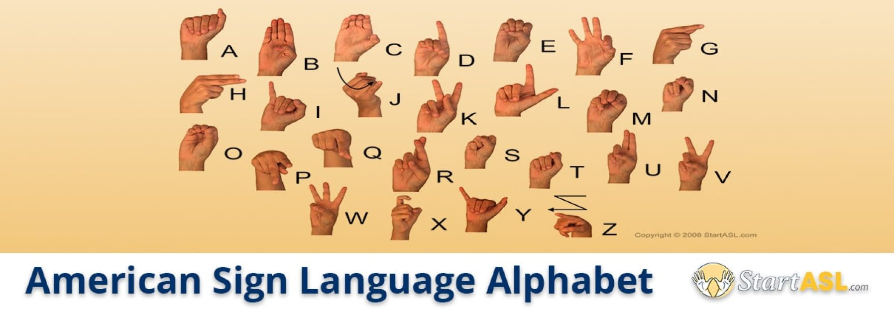

# 🤟 SignBridge

```console
$ git clone https://github.com/Prabhav77777/MerAi-internship-Projects.git
$ cd "MerAi-internship-Projects/CAPSTONE PROJECT/SIGN_BRIDGE"
$ streamlit run app.py
```

**Fingerspelling → text → Gemini cleanup → speech.** SignBridge is a browser-based ASL fingerspelling assistant built as a final MerAI capstone.

**Live demo:** [Deployment required] — no public URL is claimed until one is actually deployed.



## Features

- **Click mode:** reliable photo-by-photo recognition, confidence feedback, correction, word building, and suggestions.
- **Live mode:** `streamlit-webrtc` processing with stability detection and auto-entry. Browser/network restrictions can apply; Click mode is the fallback.
- **Data Collection Studio:** landmark capture, dataset counts, safe clearing, and candidate-model training.
- **AI and speech:** Gemini cleanup and gTTS playback both degrade gracefully when unavailable.
- **Analytics:** session-state history, Pandas editor, frequency display, and KPI metrics.

## Verified ML status

The checked-in 200-tree Random Forest uses 63 normalized landmark features. Its actual classes are **A–O (15 labels)**; historic `J` is motion-based and excluded from active single-frame targets, and `Z` is absent. The UI derives targets from `model.classes_`, currently **A–I, K–O**.

The dataset has **86 rows** and 17 exact duplicates. A reproducible 80/20 diagnostic split (`random_state=42`, non-stratified because one class has one sample) measured **77.78% accuracy** and **75.99% weighted F1**. This is not a production claim. Read [ML evaluation](docs/ml_evaluation.md).

## Architecture

`camera → MediaPipe (21 landmarks) → wrist/scale normalization → 63 features → Random Forest → buffers → Gemini → gTTS`

See [architecture](docs/architecture.md), [technical design](docs/technical_design.md), and [prompt engineering](docs/prompt_engineering.md).

## Run locally

```bash
python -m venv .venv
source .venv/bin/activate  # Windows: .venv\Scripts\activate
pip install -r requirements.txt
streamlit run app.py
```

Gemini is optional. Create the ignored `.streamlit/secrets.toml` only if wanted:

```toml
GEMINI_API_KEY = "your_key"
```

Without a key, the app opens and returns raw text. The MediaPipe task model is bundled, so normal cloud runs do not download it per rerun.

## Deploy

In Streamlit Community Cloud, select `CAPSTONE PROJECT/SIGN_BRIDGE/app.py`, then add `GEMINI_API_KEY` in Secrets. Test Click mode, model loading, and TTS. Live mode is STUN-only and may fail behind restrictive NAT/firewall policies; no paid TURN service is assumed.

## Limits

This is an educational static-fingerspelling prototype—not a medical device or full ASL translator. It does not recognize facial expression, grammar, two-handed signs, or motion paths. Candidate training writes `model_candidate.pkl`; it does not replace the active model without review.

Developer: **Prabhav Agrawal** · **MerAI Internship final capstone**
