# Architecture

```mermaid
flowchart LR
  Camera[Browser camera] --> MP[MediaPipe Hand Landmarker]
  MP --> LM[21 3D landmarks]
  LM --> Norm[Wrist-relative + scale normalization]
  Norm --> FV[63-feature vector]
  FV --> RF[Random Forest]
  RF --> Letter[Static letter]
  Letter --> Word[Word buffer]
  Word --> Sentence[Sentence buffer]
  Sentence --> Gemini[Gemini cleanup, optional]
  Gemini --> TTS[gTTS, optional]
  TTS --> Audio[Audio playback]
```

Click Mode processes a photo once and allows confirmation/correction. Live Mode runs the same pipeline through WebRTC with stable-frame auto-commit. Data Collection Studio uses the same extractor for approved samples. `model.pkl` is the class source; J/Z are excluded from active static targets because they require motion.
